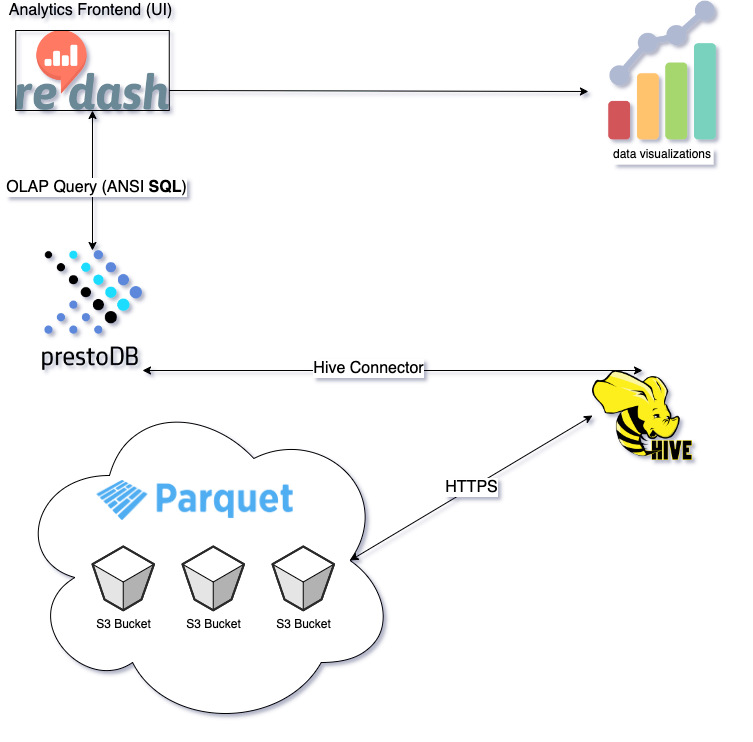

# Data warehouse + analytics frontend for fast OLAP queries

TL;DR - A fork of [AWS Athena](https://aws.amazon.com/athena/?whats-new-cards.sort-by=item.additionalFields.postDateTime&whats-new-cards.sort-order=desc) (and more) for on-prem deployments.

This project is one-click deployable data stack that is designed for analyzing data in AWS S3 using standard SQL. It also includes a self-hosted instance of [Redash](https://redash.io/) for quick data visualizations. The data stack has been optimized for OLAP query peformance and performs best when data is stored in [parquet](https://parquet.apache.org) format.

The configuration provided in this project will enable:

- Setting up a cloud-based data centralized warehouse (via S3)
- Low latency data retrieval from the data warehouse (via Presto + Hive Connector)
- Creation of visual analytics directly from SQL queries (via Redash)
- Query authorization with row-filtering feature (via Ranger) \*\*

**NOTE**: All components of the project are containerized via Docker and are cloud-agnostic with the exception of Hive which is designed to use S3 as its primary data store.

## Architecture

### Top Level View



### Components

| Frontend     |      Backend   |
|----------    |:-------------  |
| Redash       | Presto         |
| Jupyter \*\* | Apache Hive    |
|              | Apache Ranger  |

## Files

- **ranger-postgres** directory contains a Dockerfile to set up a Postgres database for Apache Ranger (for auditing purposes only).
- **ranger-admin** directory contains a Dockerfile to set up the Apache Ranger admin server.
- **hive-metastore-postgres** directory contains a Dockerfile to set up a Postgres database for the Apache Hive metastore.
- **hive-metastore-service** directory contains a Dockerfile to set up a service for exposing a thrift API on the hive metastore.
- **presto** directory contains a Dockerfile to initialize and connect Presto query engine to the hive metastore.
- **redash**  directory contains a Dockerfile to initialize the Redash server and UI (used for visual analytics)
- **jupyter** \*\*

## Setup

Before running the project, populate all the following keys in the `.env` file with the appropriate credentials.

**NOTE**: Interaction with presto happens through the `presto-cli` which requires trusted certificates. Self-signed ceritficates are generated in the `compose_data_services.sh` file and the default configurations for those can be changed.

The simplest way to run the project is to run the compose_data_services.sh file:

- `sudo ./compose_data_services.sh`

**NOTE**: The script is NOT idempotent since docker volumes and some dynamic build-time artifacts are generated for redash.
To obtain a clean run (after the script has already been run before), the following items must be removed first:

- redash/certs
- redash/postgres-data
- redash/env
- presto/keystore

**NOTE**: Currently, the script only sets up presto with hive. Ranger integration has not been added yet.
To build ranger separately for testing purposes, run `docker-compose -f docker-compose-ranger-hive.yml up`.
The ranger-admin docker image takes a long time due to having to build
the source code using Apache Maven - and hence it needs to download a large
amount of dependencies.

## Usage

To view Presto UI, visit:

- `https://localhost:4443`

To view Ranger UI, visit:

- `https://localhost:6182` (default credentials : admin/admin) <- can  be changed from ui

To view Redash, visit:

- `http://localhost:5000`

## Debugging

### Presto

Connect to the Presto coordinator (master) node by launching Presto CLI with the following parameters:

```sh
bin/presto \
    --truststore-path $KEYSTORE_DIR/truststore.jks \
    --truststore-password <enter_your_password> \
    --keystore-path $KEYSTORE_DIR/keystore.jks \
    --keystore-password <enter_your_password> \
    --server https://presto-coordinator.docker-hive-net:4443 \
    --catalog hive \
    --schema default
```

## Known Issues

Ranger configuration is provided as a POC.
It should not be deployed in production as
it uses default security credentials, auditing
is not enabled, etc.

## TO-DOs

- implement Ranger auditing via Apache Solr
- configure secure communication via TLS between Ranger and PostgreSQL
- configure secure communication via TLS between Presto and Hive
- configure secure communication to redash UI
- Add env configuration for Presto in `.env`

\*\*  Feature is currently under development
